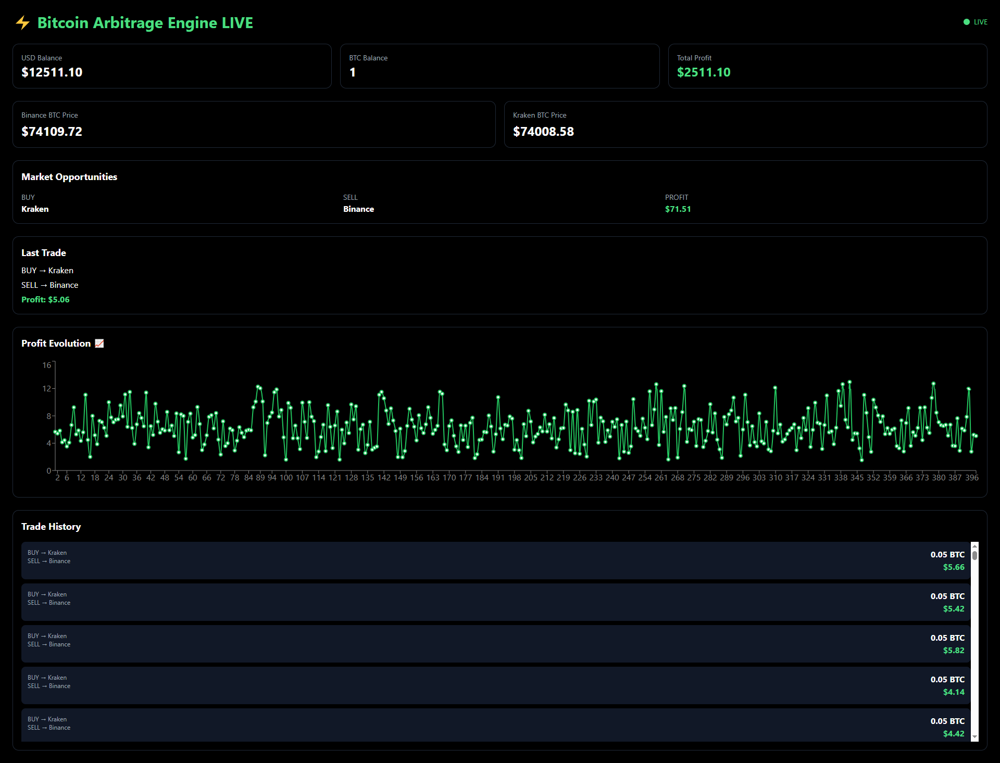

# ⚡ Bitcoin Arbitrage Trading Bot


Real-time Bitcoin arbitrage simulation platform that monitors multiple cryptocurrency exchanges, detects price inefficiencies, evaluates profitability after fees, and simulates automated trading operations through an interactive web dashboard.

---

## 📸 Dashboard Preview



---

## 🚀 Features

- 🔴 Real-time BTC market monitoring
- 🌐 Multi-exchange integration (Binance & Kraken)
- ⚡ Arbitrage opportunity detection engine
- 💰 Fee-aware profit calculation
- 🤖 Simulated trade execution
- 📊 Virtual wallet management
- 📈 Profit evolution chart
- 📜 Historical trade tracking
- 🔄 Auto-refresh dashboard updates
- 🎯 Real-time market opportunity visualization

---

## Supported Exchanges

- Binance
- Kraken

## 🟢 Live System Status

| Component | Status |
|------------|---------|
| Market Data Feed | ✅ Active |
| Arbitrage Engine | ✅ Running |
| Trade Simulator | ✅ Running |
| Wallet Tracker | ✅ Live |
| Dashboard | ✅ Live |

---

## 🧠 System Architecture

```text
React Dashboard
        │
        ▼
 Flask REST API
        │
        ▼
 Arbitrage Engine
        │
        ▼
 Exchange APIs
(Binance + Kraken)
        │
        ▼
 Trade Simulator
        │
        ▼
 Wallet + Trade History
```

---

## 🔄 How It Works

1. Fetches BTC prices from Binance and Kraken.
2. Compares prices across exchanges.
3. Detects arbitrage opportunities.
4. Calculates expected profit after trading fees.
5. Simulates buy and sell execution.
6. Updates wallet balances.
7. Stores operation history.
8. Displays results in the dashboard.

---

## 📊 Dashboard Modules

### 💼 Wallet Overview

Displays:

- USD Balance
- BTC Balance
- Total Profit (PnL)

### 📡 Live Market Prices

Displays:

- Binance BTC Price
- Kraken BTC Price

### ⚡ Arbitrage Opportunity Tracker

Shows:

- Best exchange to buy from
- Best exchange to sell to
- Estimated profit

### 🤖 Last Executed Trade

Displays:

- Buy exchange
- Sell exchange
- Profit generated

### 📈 Profit Evolution Chart

Interactive chart showing profit performance over time.

### 📜 Trade History

Complete log of simulated trades including:

- Buy exchange
- Sell exchange
- BTC amount
- Profit generated

---

## 📊 Tech Stack

### Frontend

- React
- Tailwind CSS
- Recharts

### Backend

- Python
- Flask
- Flask-CORS
- Requests

### Market Data

- Binance Public API
- Kraken Public API

---

## 📡 API Endpoints

### GET /api/prices

Returns current BTC prices from connected exchanges.

Example:

```json
{
  "binance": {
    "exchange": "Binance",
    "price": 74100.21
  },
  "kraken": {
    "exchange": "Kraken",
    "price": 74082.33
  }
}
```

---

### GET /api/arbitrage

Returns:

- Current prices
- Best arbitrage opportunity
- Simulated execution result
- Wallet state

---

### GET /api/history

Returns:

- Historical trades
- Total accumulated profit

---

## 💰 Profit Calculation

The system evaluates opportunities after considering trading fees.

Formula:

```text
Net Profit =
(Sell Price - Sell Fee)
-
(Buy Price + Buy Fee)
```

Only profitable opportunities are executed.

---

## ⚙️ Setup Instructions

### Backend

```bash
cd backend

python -m venv venv

venv\Scripts\activate

pip install -r requirements.txt

python app.py
```

Backend runs on:

```text
http://localhost:5000
```

---

### Frontend

```bash
cd frontend

npm install

npm run dev
```

Frontend runs on:

```text
http://localhost:5173
```

---

## 📈 Example Output

- Detects BTC price differences between exchanges
- Simulates arbitrage execution
- Updates wallet balances
- Tracks cumulative profit
- Visualizes trading activity in real time

---

## 🎯 Challenge Objectives Covered

✅ Real-time exchange monitoring

✅ Arbitrage opportunity detection

✅ Fee-aware profitability analysis

✅ Simulated trade execution

✅ Wallet management

✅ Historical trade tracking

✅ Real-time dashboard

✅ Data visualization

✅ Full-stack architecture

✅ Public deployment ready

---

## 🔮 Future Improvements

- WebSocket market feeds
- Order book depth analysis
- Liquidity management
- Partial order execution
- Slippage estimation
- Risk management module
- Multi-exchange support
- Advanced trading strategies

---

## Deployment Note

Binance's public API may reject requests from certain cloud regions used by hosting providers. During production deployment, requests from the hosting environment were restricted by Binance's regional access policy.

To ensure continuous operation of the arbitrage engine and allow full evaluation of the application, the system automatically falls back to simulated Binance market data derived from live Kraken market prices whenever Binance data is unavailable.

Kraken market data remains sourced from the exchange's public API, while the fallback mechanism preserves the application's arbitrage detection, trade simulation, wallet management, profit calculation, and dashboard visualization capabilities.

---


## 🧑‍💻 Author

**Lillys Hernández Ramos**

Built for **Coding Challenge Mexico 2026**

Bitcoin Arbitrage Trading System
